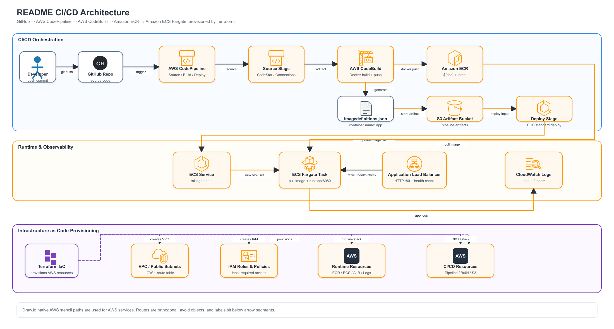
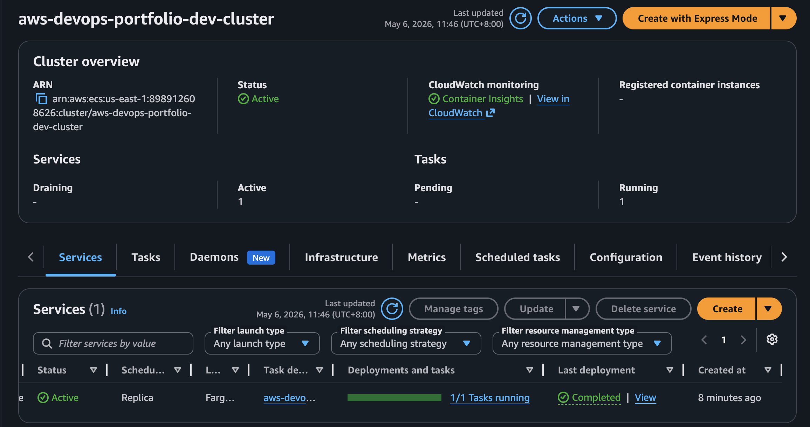
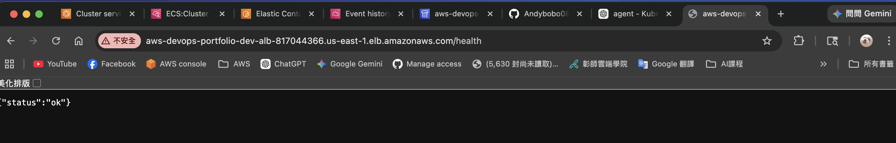
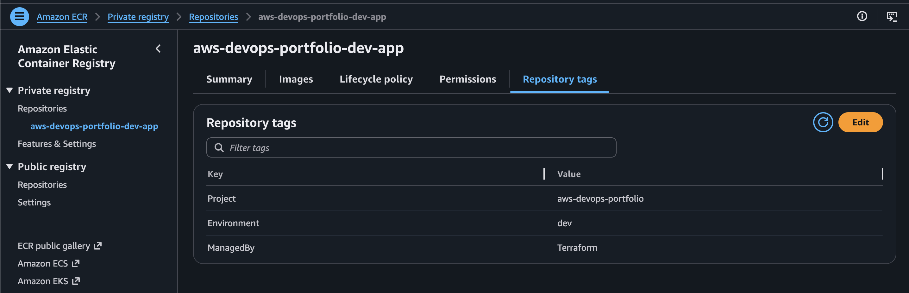

<!-- markdownlint-disable MD013 -->

# AWS DevOps 作品集：ECS、ECR、CodePipeline 與 Terraform

這是一個 AWS DevOps 專案。專案展示一條完整的自動化交付鏈：

```text
GitHub -> CodePipeline -> CodeBuild -> Amazon ECR -> Amazon ECS Fargate
```

應用程式以 Docker 容器化，映像檔推送到 Amazon ECR，服務部署到 Amazon ECS Fargate，基礎設施由 Terraform 管理，應用程式日誌由 CloudWatch Logs 收集。

## 專案目標

本專案要展示以下能力：

- 使用 Docker 將 Python Flask API 容器化。
- 使用 Terraform 建立 AWS 基礎設施。
- 使用 Amazon ECR 管理 container image。
- 使用 AWS CodeBuild 自動 build image、tag image、push image。
- 使用 AWS CodePipeline 串接 GitHub、CodeBuild 與 ECS deploy。
- 使用 Amazon ECS Fargate 執行容器服務。
- 使用 Application Load Balancer 對外提供 HTTP 服務。
- 使用 CloudWatch Logs 收集 ECS task stdout/stderr。
- 使用 Git commit SHA 前 7 碼作為 image tag，讓部署版本可追蹤。
- 使用 `imagedefinitions.json` 讓 CodePipeline ECS standard deploy action 更新 ECS service。

## 功能總覽

### 應用程式功能

- Python Flask API。
- `/` endpoint 回傳 JSON，包含：
  - `message`
  - `env`，由環境變數 `APP_ENV` 控制。
- `/health` endpoint 回傳 HTTP `200`，供 ALB target group health check 使用。
- container 對外使用 port `8080`。
- request log 輸出到 stdout，方便 CloudWatch Logs 收集。

### 容器化功能

- 使用 `Dockerfile` 建立 Python runtime image。
- 使用 Gunicorn 啟動 Flask app。
- 使用 `.dockerignore` 排除 Git、Terraform、docs 等不需要進入 image 的內容。
- 本機可用 Docker build/run 驗證服務。

### CI/CD 功能

- GitHub push 後觸發 CodePipeline。
- Source stage 使用 AWS CodeStarSourceConnection 連接 GitHub。
- Build stage 使用 CodeBuild：
  - 登入 Amazon ECR。
  - 以 repository root 建立 Docker image。
  - 使用 Git commit SHA 前 7 碼作為 image tag。
  - 同時推送 `${sha}` 與 `latest` 到 ECR。
  - 產生 ECS deploy 需要的 `imagedefinitions.json`。
- Deploy stage 使用 ECS standard deploy action：
  - 讀取 `imagedefinitions.json`。
  - 更新 ECS service 中 container name 為 `app` 的 image。
  - 讓 ECS service 執行 rolling update。

### AWS 基礎設施功能

Terraform 會建立最小可行的 AWS DevOps demo 架構：

- VPC。
- 兩個 public subnets。
- Internet Gateway。
- Public route table 與 route table associations。
- Application Load Balancer。
- Target Group，target type 使用 `ip`，符合 Fargate + `awsvpc` 常見配置。
- HTTP Listener，對外開 port `80`。
- ALB Security Group，允許 public HTTP 流量。
- ECS Service Security Group，只允許 ALB 連到 container port `8080`。
- Amazon ECR repository，啟用 image scan on push。
- ECS Cluster。
- ECS Task Definition。
- ECS Service，使用 Fargate launch type。
- ECS Task Execution Role。
- ECS Task Role。
- CloudWatch Log Group。
- S3 Artifact Bucket，供 CodePipeline 存放 artifact。
- CodeBuild Project。
- CodePipeline Pipeline。
- CodeBuild / CodePipeline / ECS 所需 IAM roles 與較小權限 policies。

### 作品集展示功能

這份作品集可用來展示：

- 我能設計 AWS 原生 CI/CD 流程。
- 我理解 ECR、ECS、CodeBuild、CodePipeline 的職責切分。
- 我能用 Terraform 管理雲端資源，而不是手動點 Console。
- 我知道 ECS standard deploy 需要 `imagedefinitions.json`。
- 我能用 Git commit SHA 做部署版本追蹤。
- 我能用 CloudWatch Logs 驗證容器服務實際有在執行。
- 我能整理 README、架構、驗證步驟與截圖證據，讓專案可被面試官快速理解。

## 架構



```text
Developer push
  -> GitHub Repository
      -> AWS CodePipeline
          -> Source Stage: CodeStarSourceConnection
          -> Build Stage: AWS CodeBuild
              -> Docker build
              -> Tag image with Git commit SHA prefix
              -> Push image to Amazon ECR
              -> Generate imagedefinitions.json
          -> Deploy Stage: Amazon ECS standard deploy action
              -> Update ECS Service
                  -> ECS Fargate Task pulls image from ECR
                      -> Application Load Balancer routes traffic

Terraform
  -> VPC / Subnets / Internet Gateway / Route Table
  -> Security Groups
  -> ALB / Target Group / Listener
  -> ECR Repository
  -> ECS Cluster / Task Definition / Service
  -> CloudWatch Log Groups
  -> S3 Artifact Bucket
  -> CodeBuild Project
  -> CodePipeline Pipeline
  -> IAM Roles and Policies

CloudWatch Logs <- ECS Task stdout/stderr
```

## CI/CD 流程

1. 開發者 push commit 到 GitHub。
2. CodePipeline 透過 CodeStarSourceConnection 取得 source code。
3. CodePipeline 進入 Build stage，啟動 CodeBuild。
4. CodeBuild 登入 Amazon ECR。
5. CodeBuild 根據 `Dockerfile` build image。
6. CodeBuild 以 Git commit SHA 前 7 碼 tag image。
7. CodeBuild 同時 push `${sha}` 與 `latest` 到 ECR。
8. CodeBuild 產生 `imagedefinitions.json`。
9. CodePipeline Deploy stage 讀取 `imagedefinitions.json`。
10. ECS standard deploy action 更新 ECS Service。
11. ECS Fargate 建立新 task，從 ECR 拉取新 image。
12. ALB health check 通過後，流量導到新 task。
13. CloudWatch Logs 可看到應用程式輸出。

`imagedefinitions.json` 範例：

```json
[{"name":"app","imageUri":"<account>.dkr.ecr.<region>.amazonaws.com/<repo>:<sha>"}]
```

其中 `name` 必須對應 ECS task definition 裡的 container name。本專案固定使用 `app`。

## 技術選型

| 類別 | 技術 | 用途 |
| --- | --- | --- |
| Application | Python Flask | 建立簡單 API demo |
| App Server | Gunicorn | 在 container 中執行 Flask app |
| Container | Docker | 將應用程式容器化 |
| Image Registry | Amazon ECR | 儲存 Docker image |
| Runtime | Amazon ECS Fargate | 執行容器服務 |
| Load Balancer | Application Load Balancer | 對外提供 HTTP endpoint |
| CI/CD Orchestrator | AWS CodePipeline | 串接 Source、Build、Deploy |
| Build Service | AWS CodeBuild | Build image、push ECR、產生 artifact |
| Infrastructure as Code | Terraform | 建立與管理 AWS 資源 |
| Logging | CloudWatch Logs | 收集 ECS task logs |
| Source | GitHub | 程式碼來源與 pipeline 觸發點 |

## 專案結構

```text
.
├── app/
│   ├── main.py
│   ├── requirements.txt
│   └── test_main.py
├── infra/
│   ├── providers.tf
│   ├── variables.tf
│   ├── locals.tf
│   ├── network.tf
│   ├── alb.tf
│   ├── ecr.tf
│   ├── logs.tf
│   ├── iam.tf
│   ├── ecs.tf
│   ├── codebuild.tf
│   ├── pipeline.tf
│   ├── outputs.tf
│   └── terraform.tfvars.example
├── docs/
│   ├── diagrams/
│   │   ├── readme-cicd-architecture.drawio
│   │   ├── readme-cicd-architecture.drawio.svg
│   │   ├── readme-cicd-architecture.png
│   │   ├── readme-cicd-architecture.svg
│   │   └── readme-cicd-flow.drawio
│   └── screenshots/
│       ├── CI:CD ve1 AWS_pipeline.png
│       ├── CI:CD ver1 .png
│       ├── CI:CD ver2 AWS_pipeline.png
│       ├── CI:CD ver2.png
│       ├── CI:CD_build process.png
│       ├── ecs_cluster.png
│       ├── service_health_check.png
│       └── terraform_ecr_image.png
├── buildspec.yml
├── Dockerfile
├── .dockerignore
└── README.md
```


### IAM

- ECS task execution role。
- ECS task role。
- CodeBuild service role 與 ECR/S3/Logs 權限。
- CodePipeline service role 與 CodeStar connection、CodeBuild、ECS、S3、IAM PassRole 權限。

## 實際截圖證據

以下截圖已放在 `docs/screenshots/`，檔名即描述截圖內容。README 使用相對路徑嵌入，讓 GitHub 頁面可直接顯示圖片。

### CI/CD Pipeline：版本 1 概覽


### CI/CD Pipeline：版本 1 階段狀態


### CI/CD Pipeline：版本 2 概覽


### CI/CD Pipeline：版本 2 詳細頁面


### CodeBuild Build Process


### ECS Cluster



### Service Health Check



### Terraform 建立的 ECR Image




## DevOps 能力展示

- Containerization with Docker。
- Infrastructure as Code with Terraform。
- Continuous Delivery with AWS CodePipeline。
- Automated Build with AWS CodeBuild。
- Image Registry with Amazon ECR。
- Deployment to Amazon ECS Fargate。
- Load balancing with ALB。
- Log collection with CloudWatch Logs。
- Versioned deployment with Git commit SHA image tags。
- Least-privilege IAM policy design。
- Release artifact generation with `imagedefinitions.json`。
```

## 參考資料

- AWS CodePipeline ECS deploy action：
  <https://docs.aws.amazon.com/codepipeline/latest/userguide/action-reference-ECS.html>
- AWS image definitions file：
  <https://docs.aws.amazon.com/codepipeline/latest/userguide/file-reference.html>
- AWS CodePipeline GitHub connections：
  <https://docs.aws.amazon.com/codepipeline/latest/userguide/connections-github.html>
- Terraform AWS provider `aws_codepipeline` resource：
  <https://registry.terraform.io/providers/hashicorp/aws/latest/docs/resources/codepipeline>
